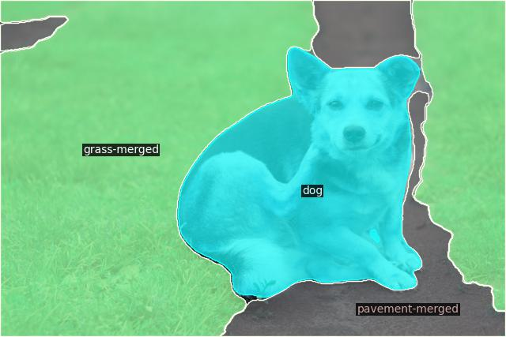
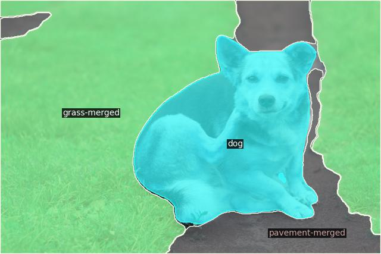

# mask2former_trt: 使用torch2trt库将Mask2former2 官方库模型转换成tensorrt

### 主要亮点
* pytorch模型直接转为原生的通过tensorrt api搭建的模型, 而不是torch_tensorrt，转换后的模型可以完全脱离torch运行
* 纯python实现，与原始仓库无缝对接 搭配自己的模型配置文件一键转换易上手
* 一个好的使用torch2trt转换复杂pytorch模型的示例
* 后续将更新支持更多的功能

## 模型转换的难点
* 在Encoder部分，msdeformattn算子实现为单独的cuda自定义操作形式，这一点使得常规的模型转换方法，例如直接转为onnx或torchscript受到了严重影响。
* 在Decoder部分，原生torch的nn.multiheadattention()算子的attn_mask参数不支持包括批次的4Dtensor，输入尺寸跟tensorrt中的不一致。

## 优化过程
* 添加MSDeformableAttnPlugin 作为自定义插件加入到torch2trt中
* 在pytorch中自己实现了支持批次的attn_mask参数的multiheadattention
* 修改了模型的一系列的实现方式，新增了N多torch2trt的自定义转换器函数确保转换能够顺利进行
* 将一些没有分支if的后处理过程融合进了模型中，进一步提升推理速度

## 注意
* 该仓库使用测试的tensorrt版本为8.6.1.6
* 原生mask2former仓库中使用的推理图像大小普遍为800，1200,在显存不够的机器下转换会直接爆显存， 建议修改cfg.INPUT中的MIN_SIZE_TEST和MAX_SIZE_TEST参数来调整模型的输入尺寸。
* 毫无疑问地，因算子实现方式不同，推理结果与原生torch存在误差，如使用中遇到不可接受的误差，请提出issue让我具体分析。
* 不要使用该仓库进行模型训练
* 
## 使用指南
1. 跟随mask2former官方库的指导完成原生mask2former的安装
*  See [installation instructions](INSTALL.md).
2. 拉取我自己维护的torch2trt库，编译新添加的MSDeformableAttnPlugin
```bash
git submoudle init
git submoudle update
cd torch2trt
```
然后将torch2trt中的CMakeList.txt中的tensorrt库和头文件的路径改为你自己的路径, 再编译安装torch2trt

```bash
python setup.py install
cmake -B build . && cmake --build build --target install && sudo ldconfig
```
3. 下载权重和测试图片后运行脚本, 像下面这样
```bash
cd demo/
python demo_trt.py --config-file ../configs/coco/panoptic-segmentation/maskformer2_R50_bs16_50ep.yaml \
  --input input1.jpg \
  [--other-options]
  --opts MODEL.WEIGHTS /path/to/checkpoint_file
```
## 效果展示
*  配置文件为panoptic-segmentation/maskformer2_R50_bs16_50ep.yaml 

*  原始图像

* 图片输入大小为427, 640
* pytorch测试结果

* tensorrt测试结果


* 推理速度: On RTX3050  1 batch size
| Pytorch | Tensorrt fp32 | 
|:-------|:--------:|
| 12.25FPS   | 20.36FPS    |

## TO DO
* ~~测试Swin backbone~~ 完成
* 支持semantic-segmentation模型
* 对batch_size > 1的情况进行完整测试和debug
* fp16 int8量化
* 对mask2former_video模型进行转换